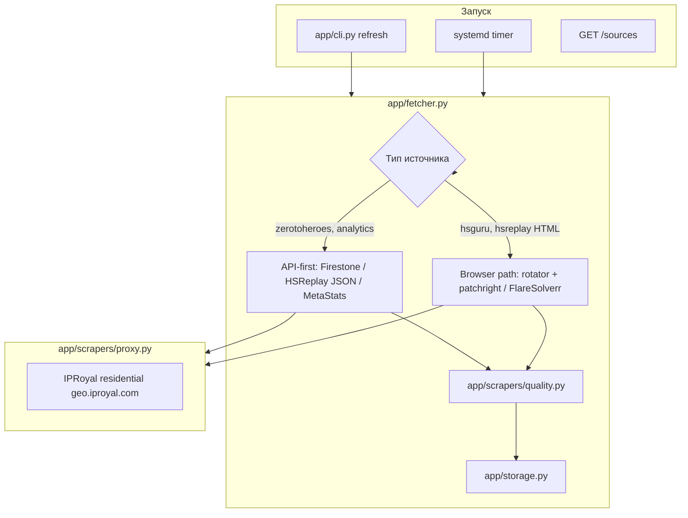
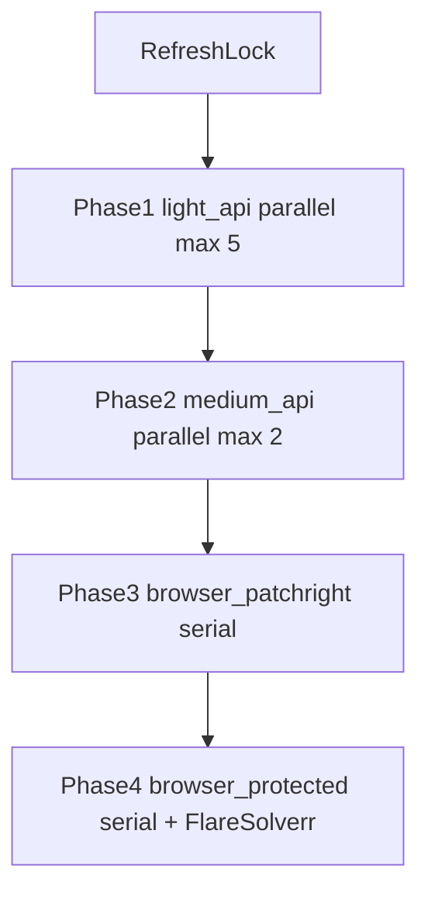

# Архитектура парсера, надёжность и ротация IP

## Схема потока данных



## Уровни защиты (что уже есть)

| Слой | Механизм | Файл |
|------|----------|------|
| Обязательный прокси | `HS_FETCH_REQUIRE_PROXY=true` — origin не видит IP сервера | `proxy.py`, `config.py` |
| Ротация бэкендов | HSGuru: FS → scrapling → patchright → curl; cap `HS_FETCH_BACKEND_MAX_SECONDS` | `rotator.py` |
| Stale Telegram | После `refresh --all`: `stale_ok` если status ok, но данные старше `HS_STALE_HOURS` | `stale_monitor.py` |
| Jitter между **браузерными** источниками | 8с × random(0.75–1.25) (`HS_REFRESH_DELAY_BROWSER_ONLY=true`) | `fetcher.py` |
| Параллель API-тиров | light_api до 5, medium_api до 2 + stagger 0.3–1.0с | `fetcher.py`, `source_tiers.py` |
| User-Agent | 6 вариантов Chrome, хэш от `source.id` | `browser_pool.py` |
| Quality gate | Минимум карт/метрик/таблиц перед сохранением | `quality.py` |
| HSReplay relogin | Авто-перелогин при истечении Premium-сессии | `fetcher.py`, `hsreplay_auth.py` |
| Telegram | Алерт при `fetch_error`, `quality_error`, CF block | `fetcher.py` |
| FlareSolverr | Отдельная browser-сессия **на каждый источник** (по умолчанию) | `fetcher.py` |

## Ротация IP (IPRoyal)

### Режимы (`/etc/hs-data-api.env`)

| Переменная | По умолчанию | Эффект |
|------------|--------------|--------|
| `HS_IPROYAL_SESSION_PER_SOURCE` | `false` | `user_session-SOURCE_ID` — **липкий IP** на источник (у вас давал **407**, оставлено off) |
| `HS_IPROYAL_ROTATE_PER_FETCH` | `false` | Новый `_session-<random>` на **каждый** HTTP-запрос — максимум ротации (тоже может дать 407) |
| *(оба false)* | **текущий прод** | Rotating residential: **новый IP на новое TCP-соединение** |
| `HS_FLARESOLVERR_SESSION_PER_SOURCE` | `true` | Новый браузер FlareSolverr на каждый source в `refresh` |

### Проверка ротации

```bash
python -m app.cli proxy-check              # один IP + краткий rotation sample
python -m app.cli proxy-rotation-check     # 8 выборок, список unique_ips
```

Если `unique_ips` = 1 при rotating-тарифе — включите `HS_IPROYAL_ROTATE_PER_FETCH=true` **или** уточните у IPRoyal, что порт 12321 — rotating, не static.

### Важно

- **Firestone / zerotoheroes** раньше ходили **мимо прокси** — исправлено: все `httpx` через `httpx_client_kwargs()` + `max_keepalive_connections=0`.
- **Patchright**: новый browser context на каждый fetch (изоляция cookies + proxy).
- Прямые API (без браузера): ~15 источников — быстрее и стабильнее, чем HTML.

## Фазы `refresh --all` (ускорение без ослабления CF-защиты)

Порядок жёстко задан в [`app/source_tiers.py`](../app/source_tiers.py) и [`app/fetcher.py`](../app/fetcher.py):



| Тир | Источников | Параллель | Пауза 8с |
|-----|------------|-----------|----------|
| `light_api` | 15 | до `HS_REFRESH_PARALLEL_LIGHT` (5) | нет |
| `medium_api` | 2 | до `HS_REFRESH_PARALLEL_MEDIUM` (2) | нет |
| `browser_patchright` | 2 (HSReplay Gold cards) | **1** | да |
| `browser_protected` | 14 (HSGuru + HSReplay HTML) | **1** | да |

**Не параллелим:** HSGuru, FlareSolverr, общий Patchright pool, два `hsreplay_cards_*` одновременно.

Откат к почти последовательному режиму без смены кода: `HS_REFRESH_PARALLEL_LIGHT=1`, `HS_REFRESH_PARALLEL_MEDIUM=1`.

В логах: `refresh phase=light_api duration=... ok=... fail=...`.

## Надёжность по типам источников (33 шт.)

| Группа | Источники | Backend | Стабильность |
|--------|-----------|---------|--------------|
| API JSON | Firestone BG/Arena, HSReplay arena, MetaStats, Hearthstone-decks, vS radars | `*_api` | Высокая |
| Browser + API | HSReplay Gold cards (`card_list`) | patchright + перехват API | Высокая |
| Browser | HSGuru meta/matchups | FlareSolverr (+ scrapling fallback) | Средняя (CF) |
| API | HSReplay BG comps | Jina markdown **или** FS HTML (`battlegrounds_comps_parse.py`) | Средняя |
| Browser | HSReplay trinkets/trending | FlareSolverr / patchright | Средняя |
| HTML parse | HearthArena tierlist | httpx + proxy | Высокая |

## Stealth-бэкенды и lab-режим

| Backend | Cron (`HS_FETCH_BACKENDS`) | Lab (`--lab-backends` / `HS_FETCH_BACKENDS_LAB`) |
|---------|---------------------------|--------------------------------------------------|
| FlareSolverr | да | да |
| Scrapling | fallback | да |
| Patchright | да | да |
| curl_cffi / cloudscraper | да | да |
| CloakBrowser | **нет** (headed, нестабилен на HSGuru) | да |

```bash
# Эксперимент с CloakBrowser на одном источнике:
/opt/hs-data-api/venv/bin/python -m app.cli refresh --lab-backends --source hsguru_meta_standard_legend
```

## HSReplay каналы

| Переменная | По умолчанию | Назначение |
|------------|--------------|------------|
| `HS_HSREPLAY_JSON_CHANNELS` | `flaresolverr,curl_cffi` | JSON API (arena, и т.д.) |
| `HS_HSREPLAY_MARKDOWN_CHANNELS` | `flaresolverr,curl_cffi` | Markdown listing/detail; **без jina** (451) |

BG comps: markdown с валидацией `_markdown_body_usable`; при провале — `fetch_hsreplay_html` + `extract_bg_comps`.

## Рекомендуемые настройки продакшена

```env
HS_FETCH_REQUIRE_PROXY=true
HS_FETCH_DIRECT_ENABLED=false
HS_API_REQUEST_DELAY_SECONDS=8
HS_FETCH_MAX_RETRIES=3
HS_FETCH_BACKEND_MAX_SECONDS=240
HS_IPROYAL_SESSION_PER_SOURCE=false
HS_IPROYAL_ROTATE_PER_FETCH=false
HS_FLARESOLVERR_SESSION_PER_SOURCE=true
HS_FETCH_BACKENDS=flaresolverr,scrapling,patchright,curl_cffi,cloudscraper
HS_FETCH_BACKENDS_LAB=cloakbrowser,flaresolverr,scrapling,patchright,curl_cffi,cloudscraper
HS_HSREPLAY_JSON_CHANNELS=flaresolverr,curl_cffi
HS_HSREPLAY_MARKDOWN_CHANNELS=flaresolverr,curl_cffi
HS_REFRESH_PREFLIGHT_STRICT=true
HS_REFRESH_PARALLEL_LIGHT=3
HS_REFRESH_PARALLEL_MEDIUM=2
HS_REFRESH_DELAY_BROWSER_ONLY=true
HS_STALE_HOURS=12
```

Очистка устаревших status-файлов без источника в `SOURCES`:

```bash
/opt/hs-data-api/venv/bin/python /opt/hs-data-api/scripts/cleanup-orphan-statuses.py
```

При частых 429/403 на одном IP: сначала увеличьте delay до 12–15с; затем попробуйте `HS_IPROYAL_ROTATE_PER_FETCH=true` (если IPRoyal не отвечает 407).

## Слабые места (мониторить)

1. **HSGuru** — FlareSolverr primary; Scrapling медленный (до 240 с cap).
2. **HSReplay comps** — Jina 451; основной путь FS HTML + enrichment detail pages.
3. **Один FlareSolverr контейнер** — SPOF для protected tier (2 GB mem_limit). Mitigated by `scripts/ensure-flaresolverr.sh` (called from refresh units' ExecStartPre) which auto-restarts once if the solver is unhealthy, plus docker healthcheck and improved `check_flaresolverr` functional probe.
4. **HSReplay Premium cookie** — один `hsreplay-auth.json` на browser HSReplay.
5. **Orphan statuses** — файлы в `statuses/` без `source_id` в `SOURCES` (удалять скриптом выше).

## Структурированные логи (JSONL)

Файл: `{HS_API_DATA_DIR}/logs/refresh-events.jsonl`

Каждая строка — JSON с полями:

| Поле | Описание |
|------|----------|
| `action` | Пошаговое действие, напр. `browser.backend.try`, `api.route.fail` |
| `action_group` | Группа: `browser`, `api`, `http`, `proxy`, `quality`, … |
| `level` | `info` / `warn` / `error` |
| `trace_id` | Корреляция всех шагов одного источника |
| `run_id` | Один полный `refresh --all` |
| `step` | Порядковый номер шага в trace |
| `source_id`, `backend`, `http_status`, `url`, `bytes`, `attempt`, `duration_ms` | Контекст |

Панель: `/ui/logs` · API: `/ops/summary`, `/ops/events`, `/ops/trace/{trace_id}`, `/ops/run/{run_id}`

Дублирование в journalctl: строки `[error|warn|info] action source=…`.

## Runbook

### Несколько источников в `fetch_error` после cron

1. Откройте `/ui/logs?api_key=YOUR_HS_API_KEY` — фильтр «только проблемные».
2. Сводка `/ops/summary` (с заголовком `X-API-Key`): поля `stale_datasets`, `hsreplay_auth`.
3. Точечный refresh (последовательно, без шторма):

```bash
HS_REFRESH_PARALLEL_LIGHT=1 /opt/hs-data-api/venv/bin/python -m app.cli refresh \
  --source SOURCE_ID_1 --source SOURCE_ID_2
```

### HSReplay API 403 / `api.route.fail`

1. `python -m app.cli preflight` — проверить proxy и каналы (`HS_HSREPLAY_JSON_CHANNELS`).
2. Убедиться, что FlareSolverr запущен: `systemctl start hs-flaresolverr`.
3. Проверить `hsreplay-auth.json` (возраст >7 дней → `hsreplay-login`).

### FlareSolverr down

Падают 11× `hsguru_*` и часть HSReplay HTML.

Авто-восстановление: refresh units запускают `scripts/ensure-flaresolverr.sh` перед preflight. Скрипт проверяет через python check (включая functional probe) и делает один `docker compose restart flaresolverr`, затем поллит до 90 с.

Ручной:
```bash
/opt/hs-data-api/scripts/ensure-flaresolverr.sh
docker compose -f /opt/hs-data-api/docker-compose.yml restart flaresolverr
/opt/hs-data-api/venv/bin/python -m app.cli preflight
```

После restart сессии сбрасываются (это нормально — per-source sessions создадутся заново).

### Proxy 407

Остановите `HS_IPROYAL_ROTATE_PER_FETCH` / `HS_IPROYAL_SESSION_PER_SOURCE`, проверьте креды. Refresh прерывает фазу `light_api` при 407.

## Команды диагностики

```bash
./scripts/audit.sh
/opt/hs-data-api/scripts/ensure-flaresolverr.sh
python -m app.cli preflight --strict
python -m app.cli proxy-rotation-check
python -m app.cli refresh --source hsreplay_cards_legend_included_popularity
curl -s http://127.0.0.1:8000/health | jq .
curl -s -H 'X-API-Key: YOUR_KEY' 'http://127.0.0.1:8000/ops/summary?since_hours=6' | jq .
```
