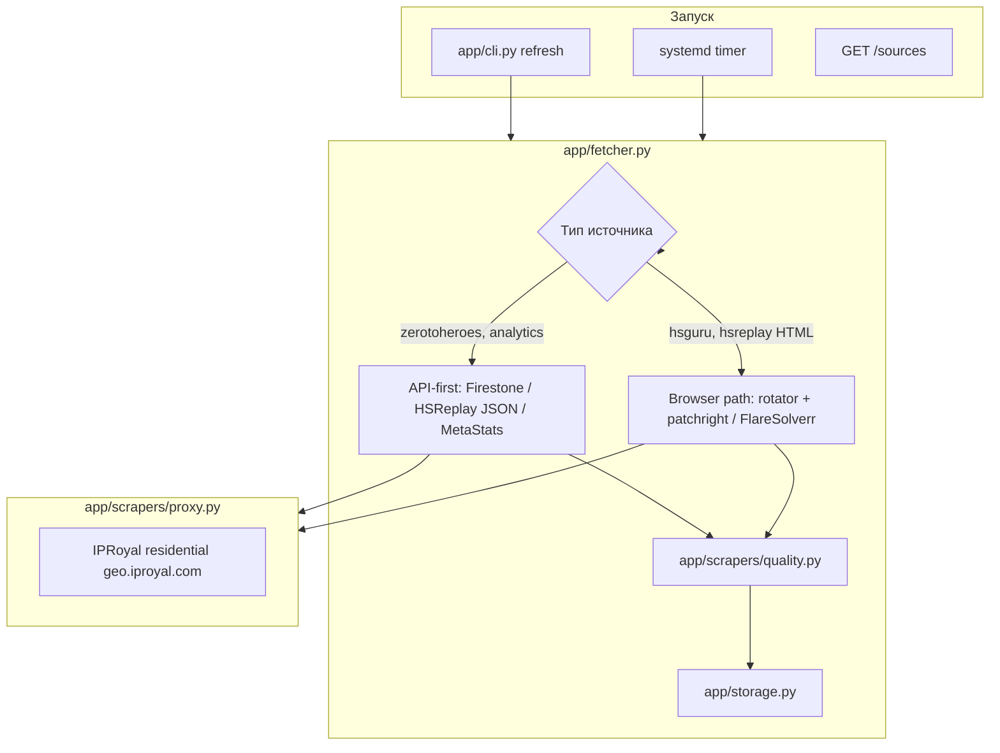

# Архитектура парсера, надёжность и ротация IP

## Схема потока данных



## Уровни защиты (что уже есть)

| Слой | Механизм | Файл |
|------|----------|------|
| Обязательный прокси | `HS_FETCH_REQUIRE_PROXY=true` — origin не видит IP сервера | `proxy.py`, `config.py` |
| Ротация бэкендов | flaresolverr → patchright → curl_cffi → cloudscraper, до 3 попыток | `rotator.py` |
| Jitter между источниками | 8с × random(0.75–1.25) | `fetcher.py` |
| User-Agent | 6 вариантов Chrome, хэш от `source.id` | `browser_pool.py` |
| Quality gate | Минимум карт/метрик/таблиц перед сохранением | `quality.py` |
| HSReplay relogin | Авто-перелогин при истечении Premium-сессии | `fetcher.py`, `hsreplay_auth.py` |
| Telegram | Алерт при `fetch_error`, `quality_error`, CF block | `fetcher.py` |
| FlareSolverr | Отдельная browser-сессия **на каждый источник** (по умолчанию) | `fetcher.py` |

## Ротация IP (IPRoyal)

### Режимы (`/etc/hs-data-api.env`)

| Переменная | По умолчанию | Эффект |
|------------|--------------|--------|
| `HS_IPROYAL_SESSION_PER_SOURCE` | `false` | `user_session-SOURCE_ID` — **липкий IP** на источник (у вас давал **407**, оставлено off) |
| `HS_IPROYAL_ROTATE_PER_FETCH` | `false` | Новый `_session-<random>` на **каждый** HTTP-запрос — максимум ротации (тоже может дать 407) |
| *(оба false)* | **текущий прод** | Rotating residential: **новый IP на новое TCP-соединение** |
| `HS_FLARESOLVERR_SESSION_PER_SOURCE` | `true` | Новый браузер FlareSolverr на каждый source в `refresh` |

### Проверка ротации

```bash
python -m app.cli proxy-check              # один IP + краткий rotation sample
python -m app.cli proxy-rotation-check     # 8 выборок, список unique_ips
```

Если `unique_ips` = 1 при rotating-тарифе — включите `HS_IPROYAL_ROTATE_PER_FETCH=true` **или** уточните у IPRoyal, что порт 12321 — rotating, не static.

### Важно

- **Firestone / zerotoheroes** раньше ходили **мимо прокси** — исправлено: все `httpx` через `httpx_client_kwargs()` + `max_keepalive_connections=0`.
- **Patchright**: новый browser context на каждый fetch (изоляция cookies + proxy).
- Прямые API (без браузера): ~15 источников — быстрее и стабильнее, чем HTML.

## Надёжность по типам источников (29 шт.)

| Группа | Источники | Backend | Стабильность |
|--------|-----------|---------|--------------|
| API JSON | Firestone BG/Arena, HSReplay arena, MetaStats, Hearthstone-decks, vS radars | `*_api` | Высокая |
| Browser + API | HSReplay Gold cards (`card_list`) | patchright + перехват API | Высокая |
| Browser | HSGuru meta/matchups | FlareSolverr | Средняя (CF) |
| Browser | HSReplay comps/trinkets/trending | FlareSolverr / patchright | Средняя |
| HTML parse | HearthArena tierlist | httpx + proxy | Высокая |

## Рекомендуемые настройки продакшена

```env
HS_FETCH_REQUIRE_PROXY=true
HS_FETCH_DIRECT_ENABLED=false
HS_API_REQUEST_DELAY_SECONDS=8
HS_FETCH_MAX_RETRIES=3
HS_IPROYAL_SESSION_PER_SOURCE=false
HS_IPROYAL_ROTATE_PER_FETCH=false
HS_FLARESOLVERR_SESSION_PER_SOURCE=true
HS_FETCH_BACKENDS=flaresolverr,patchright,curl_cffi,cloudscraper
```

При частых 429/403 на одном IP: сначала увеличьте delay до 12–15с; затем попробуйте `HS_IPROYAL_ROTATE_PER_FETCH=true` (если IPRoyal не отвечает 407).

## Слабые места (мониторить)

1. **HSGuru** — только FlareSolverr, долгие таймауты CF.
2. **HSReplay comps** — Jina/markdown, зависит от детальных страниц.
3. **Один FlareSolverr контейнер** — при падении Docker падают все HTML-источники hsguru.
4. **HSReplay Premium cookie** — один `hsreplay-auth.json` на все HSReplay browser-источники.

## Команды диагностики

```bash
./scripts/audit.sh
python -m app.cli proxy-rotation-check
python -m app.cli refresh --source hsreplay_cards_legend_included_popularity
curl -s http://127.0.0.1:8000/health | jq .
```
