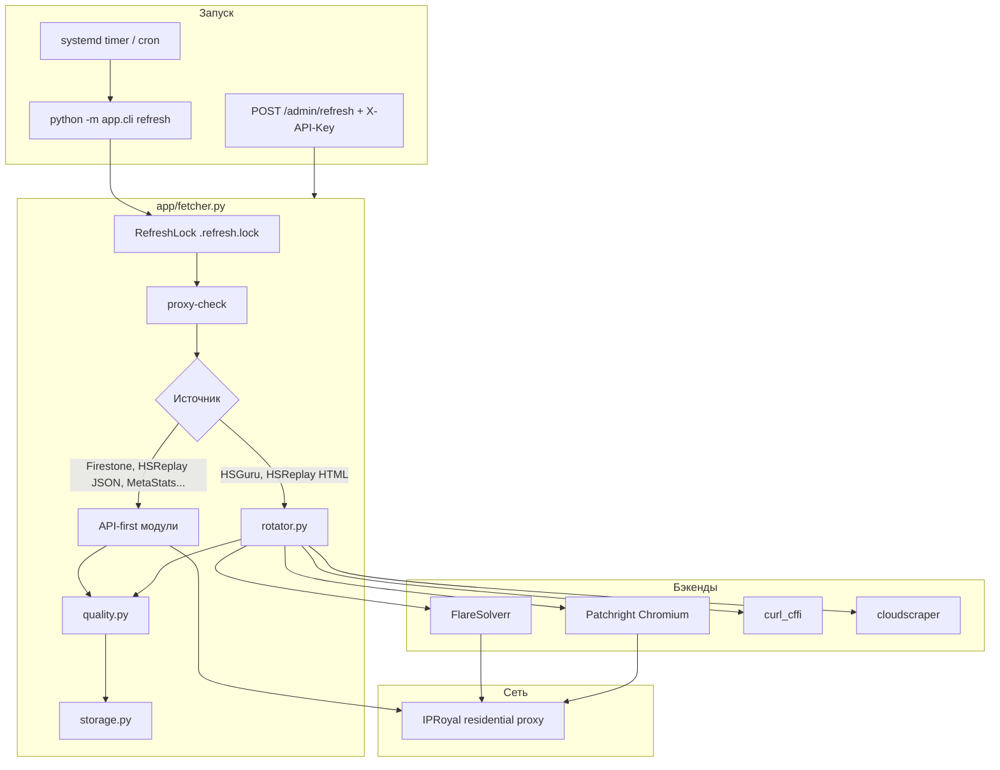

# Безопасность и парсинг Hearthstone Data API

Подробное руководство по устройству парсера на сервере, мерам защиты данных и снижению риска блокировок.  
Репозиторий: [github.com/Zulut30/hearthstone-parses](https://github.com/Zulut30/hearthstone-parses)

Связанные документы:
- [DEPLOY.md](../DEPLOY.md) — установка и перенос на другой сервер
- [PROXY_AND_RELIABILITY.md](PROXY_AND_RELIABILITY.md) — ротация IP и надёжность

---

## 1. Назначение системы

**Hearthstone Data API** — сервис кэширования публичной статистики Hearthstone с внешних сайтов (HSReplay, HSGuru, Firestone, MetaStats и др.). Он:

1. Периодически **собирает** данные (CLI / systemd timer / admin API).
2. **Проверяет качество** перед записью в кэш.
3. **Отдаёт** JSON через REST API и демо-UI.

Парсер **не** является официальным API Blizzard или партнёров. Используйте данные в рамках условий использования целевых сайтов и разумной нагрузки на источники.

---

## 2. Архитектура парсинга

### 2.1. Компоненты на сервере

| Путь | Назначение | В git |
|------|------------|-------|
| `/opt/hs-data-api` | Код приложения (Python 3.12, venv) | Да |
| `/var/lib/hs-data-api` | Кэш `datasets/`, `statuses/`, lock, индексы карт | Нет |
| `/etc/hs-data-api.env` | Секреты и настройки | **Никогда** |
| `systemd` units | API + ежедневный refresh | Да (шаблоны) |
| Docker FlareSolverr | Обход Cloudflare для HSGuru | `docker-compose.yml` |

### 2.2. Поток сбора данных



### 2.3. Два режима сбора

| Режим | Когда | Плюсы | Минусы |
|-------|--------|-------|--------|
| **API-first** | JSON/XML API, gzip с CDN (zerotoheroes, analytics HSReplay) | Быстро, стабильно, меньше CF | Зависимость от формата API |
| **Browser** | SPA, paywall, Cloudflare | Полный HTML/перехват XHR | Медленно, тяжёлый Chromium/FS |

Маршрутизация задаётся в `fetcher._fetch_hsreplay_api_source()` и списке `api_sources` в `fetcher.py`.

### 2.4. Quality gate

Перед сохранением `app/scrapers/quality.py` проверяет:

- не Cloudflare challenge;
- минимальное число строк/таблиц/карт;
- наличие метрик (winrate, placement, tier и т.д.) по типу `structured.type`.

При провале статус → `quality_error`, опционально Telegram-алерт.

### 2.5. Источники данных (33)

| ID (пример) | Сайт | Категория | Backend |
|-------------|------|-----------|---------|
| `hsguru_*` (11) | HSGuru | meta / matchups / streamer | FlareSolverr |
| `hsreplay_arena*` (4) | HSReplay | arena | hsreplay_api |
| `hsreplay_cards_*` (2) | HSReplay | ranked Gold 14d | hsreplay_cards_browser + `card_list` API |
| `hsreplay_battlegrounds_*` (3) | HSReplay | comps / trinkets | jina / browser |
| `hsreplay_decks_trending` | HSReplay | ranked | patchright |
| `firestone_battlegrounds_*` (3) | Firestone | BG | firestone_api |
| `firestone_arena_*` (4) | Firestone | arena | firestone_api |
| `heartharena_tierlist` | HearthArena | arena | heartharena_api |
| `metastats_*` (2) | MetaStats | ranked | metastats_api |
| `hearthstone_decks` | hearthstone-decks.net | ranked | hearthstone_decks_api |
| `vicious_syndicate_radars` | Vicious Syndicate | matchups | vicious_syndicate_api |

Полный список: `app/sources.py`.

**Удалённый источник:** `hsreplay_battlegrounds_heroes` (нестабильные метрики; вместо него при необходимости — Firestone API героев, модуль `firestone_bg_heroes.py`, отдельный source при добавлении).

---

## 3. Безопасность

### 3.1. Модель угроз

| Угроза | Влияние | Митигация в проекте |
|--------|---------|-------------------|
| Утечка IP сервера на HSReplay/HSGuru | Бан датацентра | `HS_FETCH_REQUIRE_PROXY=true`, все httpx/browser через proxy |
| Утечка секретов в git | Компрометация аккаунтов | `.env` в `.gitignore`, только `.env.example` |
| Несанкционированный refresh | Нагрузка, бан прокси | `POST /admin/refresh` только с `X-API-Key` |
| Публичное чтение кэша | Раскрытие агрегированной статистики | Осознанно: GET `/datasets/*` без ключа (см. ниже) |
| Кража `hsreplay-auth.json` | Доступ к Premium HSReplay | Права `600`, только root, не в git |
| Перехват Telegram bot token | Спам/чтение алертов | Только в `/etc/hs-data-api.env`, chmod 600 |
| DoS на API | Недоступность | Reverse proxy + rate limit (настраивается на nginx, не в коде) |

### 3.2. Секреты и конфигурация

Все чувствительные значения — **только** в `/etc/hs-data-api.env` (права `chmod 600`, владелец root).

| Переменная | Секрет? | Назначение |
|------------|---------|------------|
| `HS_FETCH_PROXY_URL` | **Да** | Логин/пароль резидентного прокси |
| `HS_API_KEY` | **Да** | Admin: refresh, upload dataset |
| `HSREPLAY_EMAIL` / `HSREPLAY_PASSWORD` | **Да** | Авто-перелогин Premium |
| `TELEGRAM_BOT_TOKEN` / `TELEGRAM_CHAT_ID` | **Да** | Уведомления о сбоях |
| `HS_API_DATA_DIR`, delays, backends | Нет | Операционные настройки |

**Никогда не коммитьте:**
- `/etc/hs-data-api.env`
- `/var/lib/hs-data-api/hsreplay-auth.json`
- `export-bundle.sh` архивы с env внутри
- скриншоты/логи с URL прокси

Шаблон без секретов: `.env.example` в репозитории.

### 3.3. REST API: что открыто, что защищено

| Endpoint | Auth | Описание |
|----------|------|----------|
| `GET /health` | Нет | Лёгкий liveness без внутренних деталей |
| `GET /sources`, `/sources/{id}` | Нет | Метаданные + status |
| `GET /datasets`, `/datasets/{id}` | Нет | **Полный кэш JSON** |
| `GET /demo/*`, `/ui` | Нет | Демо-интерфейс |
| `GET /system/technologies` | Нет | Публичная redacted техническая информация |
| `GET /ops/health` | `X-API-Key` | Подробное здоровье источников, stale/cache state |
| `GET /health/premium` | `X-API-Key` | Premium auth health; `live=true` делает live-probe |
| `GET /ops/summary`, `/ops/events`, `/ops/trace/{id}`, `/ops/run/{id}` | `X-API-Key` | Операционные логи и timeline refresh |
| `POST /admin/refresh` | `X-API-Key` | Запуск парсинга |
| `PUT /admin/datasets/{id}` | `X-API-Key` | Ручная загрузка JSON |

Если `HS_API_KEY` задан, неверный ключ → `401` на admin-методах.

**Рекомендация для продакшена с публичным доменом** (например `api.hs-manacost.ru`):

1. Вынести admin-пути за VPN или отдельный internal host.
2. На nginx: rate limiting на `/datasets`, basic auth или API gateway для публичного чтения при необходимости.
3. Не логировать `X-API-Key` в access.log.

### 3.4. Файловая система

```bash
# Рекомендуемые права
chmod 600 /etc/hs-data-api.env
chmod 600 /var/lib/hs-data-api/hsreplay-auth.json
chown root:root /var/lib/hs-data-api -R
```

Кэш datasets может быть большим (сотни MB) — включите в бэкапы только при шифровании архива (bundle содержит env).

### 3.5. Сетевая изоляция

- Исходящий трафик парсера → **только через прокси** (кроме localhost FlareSolverr `127.0.0.1:8191`).
- `HS_FETCH_DIRECT_ENABLED=false` — запрет обхода прокси в fetcher.
- Все модули `httpx` используют `httpx_client_kwargs()` (`app/scrapers/proxy.py`) с `max_keepalive_connections=0` для ротации IP.

### 3.6. Учётные записи HSReplay Premium

- Сессия Playwright: `HSREPLAY_STORAGE_PATH` (cookies).
- При `quality_error` «session not authenticated» — автоматический `force_relogin_hsreplay()` в `fetcher.py` (если заданы email/password).
- Ручной вход: `python -m app.cli hsreplay-login` или `hsreplay-import-storage` из браузера.

**Безопасность:** один файл сессии на все HSReplay browser-источники — компрометация файла = доступ к Premium. Не копируйте на dev-машины без необходимости.

### 3.7. Telegram-алерты

Отправляются при: `proxy_required`, `fetch_error`, `blocked_by_protection`, `http_error`, `quality_error`.

- Токен бота — секрет; отозвать через @BotFather при утечке.
- В сообщениях **нет** паролей, только `source_id`, URL страницы, `state`, `detail`.

### 3.8. Git и CI

В репозитории **нет**:
- реальных ключей API;
- `hsreplay-auth.json`;
- дампов `/var/lib/hs-data-api`.

Перед push проверка:

```bash
git grep -E 'password|token|api_key|HS_FETCH_PROXY' -- ':!*.example' ':!docs/*'
```

### 3.9. Чеклист безопасности нового сервера

- [ ] `git clone` в `/opt/hs-data-api`, не работать из home с world-readable
- [ ] Создать `/etc/hs-data-api.env` из `.env.example`, `chmod 600`
- [ ] Сгенерировать сильный `HS_API_KEY` (`openssl rand -hex 32`)
- [ ] Прокси только residential; не использовать IP датацентра для парсинга
- [ ] `HS_FETCH_REQUIRE_PROXY=true`, `HS_FETCH_DIRECT_ENABLED=false`
- [ ] Firewall: открыть только 80/443 (API), SSH по ключу
- [ ] Не публиковать bundle-архивы миграции
- [ ] Настроить logrotate для journald / app logs
- [ ] Ограничить `POST /admin/*` на reverse proxy

---

## 4. Защита от блокировок (операционная безопасность)

### 4.1. Ротация IP (IPRoyal)

| Переменная | Значение на проде | Эффект |
|------------|-------------------|--------|
| `HS_IPROYAL_SESSION_PER_SOURCE` | `false` | Sticky IP (у части тарифов **407**) |
| `HS_IPROYAL_ROTATE_PER_FETCH` | `false` | Новый `_session-*` на каждый запрос |
| Оба `false` | **Рекомендуется** | Rotating pool, новый IP на новое TCP-соединение |

Проверка:

```bash
cd /opt/hs-data-api
source /etc/hs-data-api.env  # или load через cli
venv/bin/python -m app.cli proxy-rotation-check
# Ожидание: "rotating": true, unique_ips > 1
```

### 4.2. Поведенческая рандомизация

| Механизм | Параметр |
|----------|----------|
| Пауза между источниками | `HS_API_REQUEST_DELAY_SECONDS=8` × jitter 0.75–1.25 |
| Повторы | `HS_FETCH_MAX_RETRIES=3` |
| User-Agent | 6 вариантов, привязка к `source.id` |
| FlareSolverr | `HS_FLARESOLVERR_SESSION_PER_SOURCE=true` — новая сессия на source |

### 4.3. Цепочка бэкендов

`HS_FETCH_BACKENDS=flaresolverr,patchright,curl_cffi,cloudscraper`

Порядок для HSReplay с сохранённой сессией: сначала **patchright** (см. `rotator._site_backend_order`).

### 4.4. Этичная нагрузка

- Не уменьшайте delay ниже 6–8 с без необходимости.
- Не запускайте несколько параллельных `refresh --all` (блокировка `.refresh.lock` только один процесс).
- API-first источники не дублируйте browser-fetch без причины.

---

## 5. Надёжность и мониторинг

### 5.1. Состояния источника (`statuses/*.json`)

| state | Значение |
|-------|----------|
| `ok` | Успешный сбор и quality |
| `quality_error` | Страница есть, данных мало/нет метрик |
| `fetch_error` | Исключение при fetch |
| `blocked_by_protection` | Cloudflare |
| `http_error` | 4xx/5xx |
| `proxy_required` | Нет `HS_FETCH_PROXY_URL` |

### 5.2. Команды мониторинга

```bash
# Public liveness
curl -s http://127.0.0.1:8000/health | jq .

# Подробная диагностика источников
source /etc/hs-data-api.env
curl -s -H "X-API-Key: ${HS_API_KEY}" http://127.0.0.1:8000/ops/health | jq .

# Premium auth local/live checks
curl -s -H "X-API-Key: ${HS_API_KEY}" http://127.0.0.1:8000/health/premium | jq .
curl -s -H "X-API-Key: ${HS_API_KEY}" "http://127.0.0.1:8000/health/premium?live=true" | jq .

# Строгий аудит кэша
./scripts/audit.sh

# Прокси
python -m app.cli proxy-check
python -m app.cli proxy-rotation-check

# Один источник
python -m app.cli refresh --source hsreplay_cards_legend_included_popularity

# Логи systemd
journalctl -u hs-data-api -u hs-data-api-refresh -f
```

### 5.3. Systemd

| Unit | Роль |
|------|------|
| `hs-data-api.service` | Uvicorn REST API |
| `hs-data-api-refresh.service` | Однократный `refresh --all` |
| `hs-data-api-refresh.timer` | Расписание (обычно раз в сутки) |

Timer не должен совпадать с пиковой нагрузкой на прокси других задач.

### 5.4. Типичные сбои и действия

| Симптом | Вероятная причина | Действие |
|---------|-------------------|----------|
| `blocked_by_protection` | CF / Imperva | Проверить FlareSolverr, сменить IP (`proxy-rotation-check`) |
| `quality_error` + HSReplay | Сессия Premium | `hsreplay-login`, проверить `hsreplay-auth.json` |
| `407` на прокси | Неверный sticky session | Оставить `HS_IPROYAL_SESSION_PER_SOURCE=false` |
| FlareSolverr timeout | Docker/память | `docker compose restart`, увеличить timeout |
| Пустой Firestone | Прокси не использовался (старый код) | Обновить код, `refresh` Firestone sources |

---

## 6. Парсинг по ключевым источникам (технические детали)

### 6.1. HSReplay Gold cards

- URL: `#rankRange=GOLD&timeRange=LAST_14_DAYS`
- Данные: `GET /analytics/query/card_list/?GameType=RANKED_STANDARD&...`
- Модуль: `app/hsreplay_cards_api.py` (Patchright + перехват API + парсер `series.data`)
- Quality: ≥30 карт, ≥20 с `deck_winrate` / `deck_popularity`
- Paywall Gold: **нет** Premium-auth для rank GOLD

### 6.2. Firestone Battlegrounds

- CDN: `static.zerotoheroes.com` (gzip JSON)
- Модули: `app/firestone_comps.py` (`fetch_firestone_cards`, `fetch_firestone_comps`)
- Все запросы через `httpx_client_kwargs(source.id)`
- Quality `bg_card_stats`: ≥50 карт, ≥40 с `average_placement`

### 6.3. HSGuru

- Cloudflare → FlareSolverr обязателен
- HTML tables → `parser.py` / `structured.py`
- Самый чувствительный к блокировкам класс источников

### 6.4. HearthArena

- Прямой HTML tierlist (`/ru/tierlist`, fallback `/tierlist`)
- `app/heartharena.py`, прокси, без Premium
- Quality: ≥300 карт, tier_id на карточках

---

## 7. Миграция и бэкап (безопасность)

```bash
# Экспорт (содержит секреты!)
./scripts/export-bundle.sh /root/hs-migrate.tar.gz

# Передача — только scp/rsync по SSH, не email/cloud без шифрования
scp /root/hs-migrate.tar.gz user@new-host:/tmp/

# Импорт на новом сервере
sudo ./scripts/import-bundle.sh /tmp/hs-migrate.tar.gz
```

После миграции смените `HS_API_KEY` и пароль прокси, если архив мог утечь.

---

## 8. Обновление кода

```bash
cd /opt/hs-data-api
git pull
venv/bin/pip install -r requirements.txt
venv/bin/patchright install chromium
sudo systemctl restart hs-data-api
# точечный пересбор кэша при изменении парсера:
venv/bin/python -m app.cli refresh --source <SOURCE_ID>
```

Документация в `docs/` обновляется вместе с кодом в репозитории `hearthstone-parses`.

---

## 9. Контакты и ответственность

- Оператор сервера отвечает за: хранение `/etc/hs-data-api.env`, ротацию ключей, соблюдение ToS сайтов-источников.
- Разработчик репозитория: Issues/PR на GitHub `Zulut30/hearthstone-parses`.

**Версия документа:** 2026-06-02 (ветка `main`, 33 источника, без `hsreplay_battlegrounds_heroes`).
